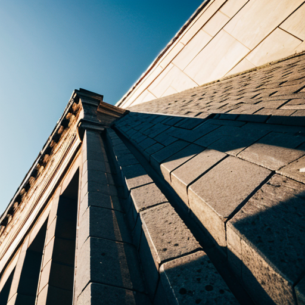
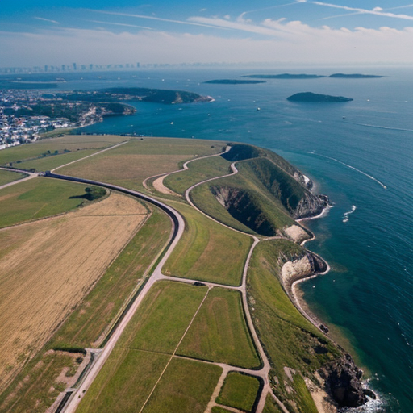

# Углы обзора

## low angle - Низкий угол

Фотография сделана снизу вверх, что может придать объекту величественности или создать ощущение мощи и власти. Очень хорошо подходит для генерации архитектуры

## high angle - Высокий угол

Фотография сделана сверху вниз, что может изменить восприятие размера и важности объекта, а также создать ощущение уязвимости или подчиненности. Очень хорошо подходит для генерации видов природы с высоты птичьего полета (смотри так же [bird eyes view](./position.md#bird-eyes-view---высота-птичьего-полета)). При использовании с объектами может ломать геометрию

## tilt angle - Угол тильта
